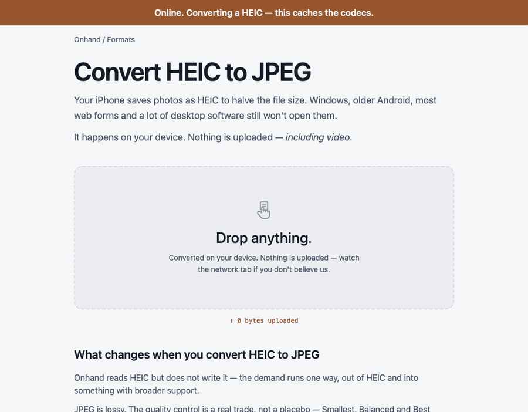

<div align="center">

# Onhand

**Every file converter on one page. Nothing is ever uploaded — including video.**

[](https://onhand.pages.dev)
[](https://github.com/SirSicard/onhand/actions)
[](LICENSE)
[](#privacy)

</div>

**Drop a file. Get it back in another format. It never leaves your machine.**

Every cloud converter — CloudConvert, Convertio, Zamzar, FreeConvert — works the
same way: you upload to their server, they convert, you download. That
architecture is why they all have to meter you. CloudConvert charges by the
minute. Convertio caps free files at 100 MB. Zamzar allows 50 MB and two files a
day.

They aren't being greedy. Server conversion genuinely costs them money per file.

Onhand doesn't have that cost, because there is no server. WebAssembly and
WebCodecs run the codecs in your tab, on your silicon. "Free" isn't a
promotional tier that gets squeezed later — it's just what the thing costs.

<p align="center">
  
</p>

<p align="center">
  <sub>Not a mock-up. Chromium's network stack is switched off partway through —
  <code>navigator.onLine = false</code> is on camera — and the conversion runs anyway.
  Recorded by <a href="scripts/make-airplane-gif.mjs"><code>pnpm airplane</code></a>.</sub>
</p>

## How you can check we mean it

- A live **`↑ 0 bytes uploaded`** counter runs in the header while you convert.
  It is not decoration: it wraps `fetch`, `XMLHttpRequest` and `sendBeacon` and
  counts the bytes this page actually sends.
- Open DevTools → Network and watch. There is nothing to see.
- Turn off your wifi. After one visit it still works.
- The site makes **zero external requests** — no CDN, no fonts, no analytics.
  CI fails the build if an external URL appears in the output.
- Read the source. It's MIT.

## What it does

**23 formats, 159 conversions** — every one generated from a single capability
table, so the site cannot advertise a pair the engines can't actually perform.
Every competitor's format list is marketing copy and half the entries fail
silently.

|            |                                                                            |
| ---------- | -------------------------------------------------------------------------- |
| **Images** | jpg png webp avif **heic** gif bmp tiff ico svg → jpg png webp avif        |
| **Audio**  | mp3 wav m4a aac ogg opus flac → any of the same                            |
| **Video**  | mp4 mov webm mkv avi → mp4 mov webm mkv, plus extract-audio to mp3/m4a/wav |
| **PDF**    | images → pdf; pdf → one image per page, zipped                             |

Drop a folder and it converts the lot. Set every row to one format, or each
individually, then download everything as a zip. After one visit it works
offline — and the badge only appears when the codecs for _your_ queued formats
are genuinely cached, not merely because a service worker exists.

### The part that is actually hard

Browser video conversion has two routes and neither is sufficient alone.

**WebCodecs** uses the codecs already in your browser, usually
hardware-accelerated. Fast, no download — but the gaps are large and uneven.
Most browsers cannot encode MP3, Firefox has no AAC encoder, Chrome and Safari
have no Vorbis encoder, and none can demux AVI. _Which_ gaps you have depends
on your browser and your operating system: Firefox does encode Vorbis, and
some Linux WebKit builds do encode MP3.

**ffmpeg.wasm** does all of it, and is a 9.7 MB download.

Onhand uses the first wherever it works and falls through to the second when it
doesn't. You never see the choice. There is deliberately no browser-support
table to go stale: the engine names the codec it wants and asks the browser at
runtime whether it can encode it — so on a browser that _does_ have an MP3
encoder, you get the fast path automatically, with no code change here. Writing
that table by hand would have been wrong within a month; a test that asserted
one was wrong within a day.

Measured — `mov` → `mp4`, same file, same verified output:

| Browser         | Engine used                  | Time       |
| --------------- | ---------------------------- | ---------- |
| Chromium        | WebCodecs                    | **112 ms** |
| Safari (WebKit) | WebCodecs                    | **156 ms** |
| Firefox         | ffmpeg.wasm — no AAC encoder | 3,728 ms   |

That 33× gap is why the routing exists instead of always using ffmpeg.

The nearest thing to this is [VERT.sh](https://vert.sh) — open source, good, and
worth your time. Its own tagline says "fully local\*", and the asterisk is video,
which routes to a server. Onhand's bet is that
[WebCodecs going near-baseline](https://caniuse.com/webcodecs) means that
asterisk no longer has to exist.

## Privacy

- **No upload.** Files are read locally and converted in a Web Worker. No file
  bytes are sent anywhere, because there is nowhere to send them.
- **No analytics, no telemetry, no crash reporting, no cookies, no accounts.**
  Not "anonymised" — absent.
- **No fonts, scripts or images from anyone else.** The site sets
  `Cross-Origin-Embedder-Policy: require-corp`, which would block third-party
  resources even if we wanted them.
- **Metadata is stripped by default.** Photos carry the GPS coordinates of where
  they were taken, and nobody reads the advanced panel.
- The counter measures bytes **sent**, not bytes received. Those are different
  numbers, and conflating them was one of the bugs in this repo's history: the
  first version proudly reported "600 B uploaded" while uploading nothing.

## Limits, honestly

- **About 1.8 GB of working memory**, which is what a browser tab has. Onhand
  estimates before starting and refuses with a number and a suggestion rather
  than crashing the tab twenty minutes in. Practically: video to ~300 MB, images
  to ~90 MB.
- **HEIC decodes, it does not encode.** Nobody wants a HEIC; they want out of one.
- **GIF is first frame only.** Animation needs frame handling the image path
  doesn't do yet.
- **AVI reads but doesn't write.** It's a container people escape, not one they
  ask for.
- **No Office documents** (docx/xlsx/pptx). LibreOffice-in-the-browser is a
  ~250 MB download and unstable as of 2026. When that changes, this line changes.
- **The first ffmpeg conversion downloads 9.7 MB**, once, then cached. The page
  says so before it starts, with real byte progress.
- **Firefox falls back to ffmpeg for anything needing AAC**, so `mov` → `mp4` is
  seconds there instead of milliseconds. Correct either way.
- **Stereo Opus needs a browser with a WebCodecs Opus encoder** — which Chrome,
  Firefox and Safari all have, so this affects almost nobody. The bundled
  ffmpeg (5.1.4) has a defect where libopus faults on any stereo input;
  measured, and not specific to a container or source codec. Forcing mono would
  "work" by silently discarding a channel, so Onhand says what happened
  instead.

## Development

```bash
pnpm install
pnpm dev            # http://localhost:4321
pnpm typecheck
pnpm test           # node: pure logic
pnpm test:browser   # chromium: the real conversion matrix
pnpm build
```

Requires Node 26 (see `.nvmrc`). Deploys to Cloudflare Pages as a fully static
site.

The dev server sets the same COOP/COEP headers as production. That isn't
optional — without cross-origin isolation `SharedArrayBuffer` is unavailable and
the multithreaded codec path silently never engages, which is a bug you'd only
find after deploying.

`prebuild` copies and gzips the ffmpeg core into `public/`; `postbuild`
generates the service worker. **Use `pnpm build`, never `astro build`** —
skipping those hooks yields a site whose audio conversions 404 and which has no
offline support, with no error to explain either.

Conversion tests need a real browser, because mocking a wasm codec tests the
mock. **522 browser tests run across Chromium, Firefox and WebKit**, plus 62 in
node. The cross-browser matrix runs nightly rather than per-push: browser
differences change with browser releases, not with our commits.

## Contributing

Bug reports and pull requests are welcome — see [CONTRIBUTING.md](CONTRIBUTING.md).
Security issues go through [GitHub private reporting](SECURITY.md), not a public
issue.

## Licence

Onhand is [MIT](LICENSE).

It ships FFmpeg (**GPL-2.0-or-later**) and libheif (**LGPL-3.0**) as separate,
unmodified binaries loaded on demand. That distinction matters and is written up
properly in **[THIRD_PARTY.md](THIRD_PARTY.md)** — including what would have to
change to drop the GPL component, and what that would cost.

---

<div align="center">
<sub>Built by <a href="https://github.com/SirSicard">Mattias Herzig</a>. No accounts, no telemetry, no ads, no paid tier.</sub>
</div>
